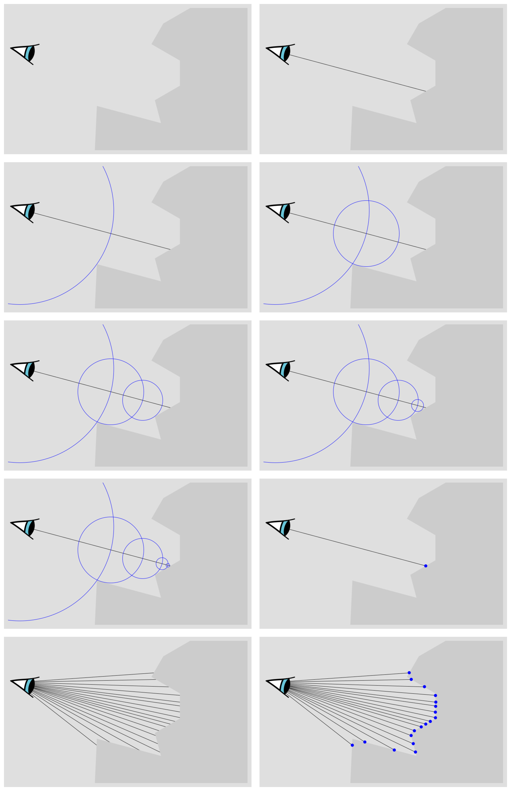

Ray marchers are a category of very cool rendering algorithms which let you
draw all kinds of interesting scenes in 3D. This website explains how ray
marching works, as well as many advanced details. You will learn about:

- Sphere tracing.
- Distance functions.
- Distance function transformations.
- Phong lighting.
- Soft shadows.
- Ambient occlusion.
- Terrain marching.
- Fractals.

### Fragment shaders

Fragment shaders are simple programs that "shade" (pick the color of) pixels on
the screen. We write them in a language called GLSL. They take two types of
input:

  - Uniform variables: Things like the screen's resolution, the current
    time, and the cursor's position.
  - `gl_FragCoord`: The location of the pixel which is being shaded.

And they have a single output:

  - `gl_FragColor`: The pixel's color, in the format (red, green, blue, alpha)
    where all the components are numbers between 0 and 1.

Fragment shaders cannot communicate with each other and cannot save any
variables between subsequent executions. Despite their limitations, every
program we write will each be contained in nothing but a fragment shader. This
is one of the many unique features of ray marching algorithms.

To learn how to write shaders in general, you can look at [A Beginner's Guide
to coding graphics shaders][shadertut]. Or for GLSL documentation, look at
[OpenGL Shading Language][glslreference].

### Ray marching overview

Our ray marching algorithm is very simple. We will work with a distance
function that describes a shape, which is simple a function that takes a 3D
coordinate `p` and returns the distance of `p` from the boundary of a shape.
For example, the distance function for a sphere with radius `r` is

```glsl
float sdfSphere(vec3 p, float r) {
    return length(p) - r;
}
```

To draw a shape using its distance function, we want to fire out many rays from
the viewer's eye position (one for each pixel) into many different directions.
We march along each ray until the distance function says we're touching the
boundary of the shape (i.e, it returns almost 0) or the ray missed the shape
and we are heading off to infinity. This tells us either how far the shape
boundary is from the viewer's eye position, or that the ray missed the shape
and continued on to infinity. We can use this information to find the point
where each ray intersects that shape, and from there we can apply lighting and
shadows to the shape accordingly.

<figure>
    
    <figcaption>A visualisation of the sphere tracing algorithm. The blue
    circles represent the ouput of the distance function. The blue dots are
    points on the surface found by the ray marcher.</figcaption>
</figure>

We will discuss the algorithm in more detail in a later section. But first, we
need to figure out which direction to send the rays.

### Casting rays

We have in our scene the viewer's eye position, and a window into our world
located 1 unit away from the viewer, with the same aspect ratio as the canvas
that we will be painting on. From the eye position, we want to send a ray
through each pixel. For simplicity we will assume the viewer's eye position is
at $(0,0,0)$. For each pixel we want to send a ray through, we have as inputs:

- $\text{PRaster}$: The x and y coordinates of the pixel (called the raster
  coordinates).
- $\text{Resolution}$: The width and height of the canvas in pixels.

We convert the raster coordinates of the pixels to its normalized device
coordinates $\text{PNDC}$, so that $\text{PNDC}_x \in [0,1]$ and
$\text{PNDC}_y \in [0,1]$.

$$\text{PNDC} = \frac{\text{PRaster}}{\text{Resolution}}.$$

Then we convert to the screen space coordinates $\text{PScreen}$ which are
$\text{PScreen}_x \in [-1,1]$ and $\text{PScreen}_y \in [-1,1]$.

$$\text{PScreen} = 2 \cdot \text{PNDC} - (1,1).$$

But we need to take into account the aspect ratio of the canvas
$\text{AspectRatio}=\frac{\text{Resolution}_x}{\text{Resolution}_y}$ to find
the world coordinates of the pixel

\begin{align\*}
    \text{PWorld}_x &= \text{PScreen}_x \cdot \text{AspectRatio},\\\
    \text{PWorld}_y &= \text{PScreen}_y,\\\
    \text{PWorld}_z &= -1.
\end{align\*}

We have also assumed that the viewer is facing the direction $(0,0,-1)$. This
choice is somewhat arbitrary but is customary in computer graphics we we'll
stick with it. Unfortunatelly this isn't the whole story, we'll want to scale
the size of the window depending on a chosen field of view ($\text{FOV}$),
an angle that decides how much of the world the viewer can see. We come up
with the field of view factor $f=\tan\left(\frac{\text{FieldOfView}}{2}\right)$
and change $\text{PWorld}$ to

\begin{align\*}
    \text{PWorld}_x &= \text{PScreen}_x \cdot \text{AspectRatio} \cdot f,\\\
    \text{PWorld}_y &= \text{PScreen}_y \cdot f,\\\
    \text{PWorld}_z &= -1.
\end{align\*}

With these formulas, we can precisely lay out our ray marching algorithm.

### Sphere tracing

We will look at the ray marching algorithm known as sphere tracing. Which is
the algorithm described previously, but when we march along a ray, how far do
we go with each step? Well, if we're at a point `p` and the distance function
says we're `d` units aways from the boundary of the shape, we can just march
`d` units along the ray and we'll get close to it without going through it!
Finally an implementation (acting on each pixel `gl_FragCoord`):

```glsl
uniform vec2 resolution;

// Returns the distance of point p to a sphere of radius r
float sdfSphere(vec3 p, float r) {
    return length(p) - r;
}

void main() {
    gl_FragColor = (0, 0, 0, 1) // Start with a black color

    vec3 PWorld = ...; // Point of pixel in world space
    vec3 rd = normalize(PWorld); // The ray direction
    float t = 0; // How far we've travelled along the ray

    for (int i = 0; i < 1000; i++) {
        vec3 p = rd * t; // The point along the ray we are at
        float d = sdfSphere(p, 2); // The distance from p to the sphere of radius 2
        t += d; // Move forward along the ray

        if (d < 0.001) { // If p is very close the boundary of the sphere
            // Compute the lighting, shadows, etc
            gl_FragColor = computeShadingForPoint(p);
            break;
        }

        if (t > 100) { // If the ray missed the shape and went off to infinity
            break;
        }
    }
}
```

We could change `sdfSphere` to a shape or combination of shapes of any
complexity to render any scene imaginable, which we will look into later. We
will finish off with a method to shade the shape.

### Shading

To compute how much lighting is hitting a point `p`, we need to find the normal
to the surface at that point, which can be done with what's known as the
central differences method. We find six points on the shape's surface very
close to `p`, which approximates the rate of change with respect to `p.x`,
`p.y`, and `p.z`. Taken together, these three values give us a vector which is
the gradient of the surface at `p`.

```glsl
vec3 normal(vec3 p) {
    vec2 eps = vec2(0.0001, 0.);
    vec3 n = vec3(
            sdfSphere(p + eps.xyy, 2.) - sdfSphere(p - eps.xyy, 2.),
            sdfSphere(p + eps.yxy, 2.) - sdfSphere(p - eps.yxy, 2.),
            sdfSphere(p + eps.yyx, 2.) - sdfSphere(p - eps.yyx, 2.));
    return normalize(n);
}
```

A simple method of lighting our scene is with the Phong reflection model, which
states that given the parameters:

- $\alpha$: Shininess, how shiny the surface is (lower value means shinier)
- $k_d$: Diffuse reflection constant, how bright light hitting the surface is
- $k_s$: Specular reflection constant, how bright the shiny bits are
- $k_a$: How much ambient light is there (light bouncing around everywhere)
- $\text{lights}$: The set of all lights
- $\hat{L}_m$: Direction from point on surface to light source $m$
- $\hat{N}$: Normal at the point on the surface (from the `getNormal` function)
- $\hat{R}_m$: Direction a ray of light would take if it came from light source
  $m$ and bounced off the surface. This can be computed in GLSL with
  $\text{reflect}(-\hat{L}_m,\hat{N})$
- $\hat{V}$: Direction from the surface to the viewer

The surface illumination is given by

$$
    I_{\text{p}} = k_{\text{a}}i_{\text{a}} +
        \sum_{m\;\in \;{\text{lights}}}
            (k_{\text{d}}({\hat {L}}_{m}\cdot {\hat {N}})i_{m,{\text{d}}} +
            k_{\text{s}}({\hat {R}}_{m}\cdot {\hat {V}})^{\alpha }i_{m,{\text{s}}}).
$$

### Putting it all together

Armed with this information, we can build a fully working example:



[shadertut]: http://gamedevelopment.tutsplus.com/tutorials/a-beginners-guide-to-coding-graphics-shaders--cms-23313 "A Beginner's Guide To Coding Graphics Shaders"
[glslreference]: https://www.opengl.org/wiki/OpenGL_Shading_Language "OpenGL Shading Language"
